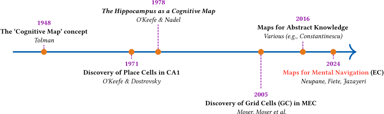
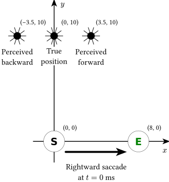
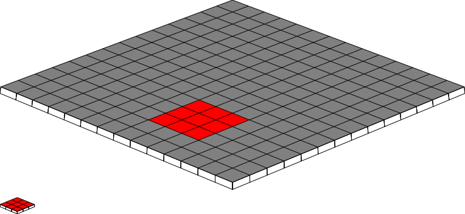

# typst-snippets

## What is this?

[Typst](https://typst.app/) is great, but it's still quite young.
As a result, it can be difficult to find up-to-date examples for various common tasks.

I am using Typst regularly, and while most of my output is project-specific and not for (immediate) public release, I sometimes end up producing self-contained snippets that lend themselves well to being adapted.

This repo is meant as a home for such snippets, when I find the time to properly clean up and extract them.

## How to use

Each `.typ` file can directly be compiled with `typst compile` or `typst watch` without any special considerations. All files are independent; you can copy the one(s) you need to your repository directly, and start customizing it.

For convenience (mostly for this README), a `justfile` is defined in this repository and allows for compiling all diagrams simultaneously to SVG.

## Contents

### Repurposable timeline

Source: [`timeline.typ`](./timeline.typ)

### Task schematic with axes for a visual task

Source: [`pbm.typ`](./pbm.typ)

### Uniform tiling of the plane, shown in perspective, with highlight

Source: [`3d_tiling.typ`](./3d_tiling.typ)

## License

The contents of this repository are licensed under the MIT license. See `LICENSE` for details.
